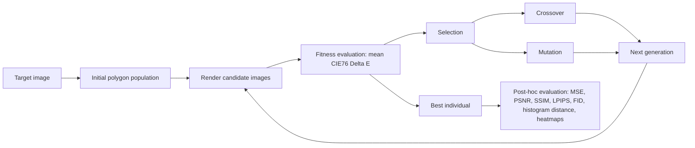

# Polygon-Based Genetic Algorithm for Targeted Image Evolution

A curated portfolio version of a Bio-inspired Learning coursework project that evolves target images using a polygon-based Genetic Algorithm (GA).

The system represents candidate images as layered semi-transparent polygons and iteratively improves them through selection, crossover and mutation. Fitness is driven by perceptual color difference in Lab color space using CIE76 ΔE\*, while additional image-quality metrics such as MSE, PSNR, SSIM, LPIPS, FID and histogram distance are used for post-hoc analysis.

## Project Overview

This project reframes image approximation as an evolutionary optimization problem. Instead of optimizing pixels directly, each candidate solution is rendered from translucent polygons with variable geometry, color and transparency. Over many generations, the population evolves toward a given target image.

The original academic work tested the system on three visually different targets: a grayscale portrait, a flat-color geometric tiger illustration and a classical painting. The goal was not to build a production image-generation system, but to provide an interpretable educational case study connecting classical evolutionary computation with modern perceptual image-quality assessment.

The original academic report is included in [`reports/polygon_ga_image_evolution_paper.pdf`](reports/polygon_ga_image_evolution_paper.pdf). It contains the full methodology, visual examples, final evolved images, metric analysis and perceptual heatmaps from the coursework project.

## Evolutionary Pipeline



## Key Features

- Polygon-based image representation with RGBA colors and 3-to-6-vertex primitives.
- Population-based evolutionary process with selection, crossover and mutation.
- CIE76 ΔE\* fitness computed in Lab color space.
- Post-hoc evaluation using MSE, PSNR, SSIM, LPIPS, FID and histogram distance.
- Visual outputs such as evolutionary GIFs, generation snapshots, metric plots and perceptual difference heatmaps.
- Modular Python notebook implementation for experimentation with custom target images.

## Methodology

The evolutionary loop follows the standard GA structure:

1. Initialize a population of random polygon-based images.
2. Render each individual as a candidate image.
3. Evaluate each candidate against the target image.
4. Select parent candidates.
5. Generate new candidates using crossover and mutation.
6. Repeat across generations while logging the best candidate and evaluation metrics.

The original implementation used CIE76 ΔE\* as the optimization fitness:

```text
F(candidate) = mean(ΔE*_{CIE76}(target, candidate))
```

Lower fitness indicates a candidate image closer to the target in perceptual Lab color space. Other metrics were computed after or during runs for interpretability and comparative analysis, but they were not the primary optimization objective.

## Reported Results

The original coursework reported final metrics for two completed experiments: Einstein and the geometric tiger.

| Metric | Einstein | Tiger |
|---|---:|---:|
| MSE | 862.33 | 1132.29 |
| PSNR (dB) | 18.77 | 17.59 |
| SSIM | 0.3433 | 0.6752 |
| ΔE\* (CIE76) | 13.40 | 17.80 |
| Histogram distance | 7.97 | 13.28 |
| LPIPS | 0.5954 | 0.2882 |
| FID | 442.44 | 271.06 |

The results show that different metrics reward different aspects of image similarity. Pixel-wise metrics such as MSE and PSNR capture low-level reconstruction error, while SSIM, LPIPS and FID better reflect structural and perceptual similarity. This makes the project useful as a practical example of why perceptual evaluation is important in image generation.

For the full visual results, including target-vs-generated comparisons and perceptual difference heatmaps, see the included academic report in [`reports/`](reports/).

## Repository Structure

```text
polygon-ga-image-evolution/
│
├── README.md
├── requirements.txt
├── .gitignore
├── LICENSE
│
├── notebooks/
│   └── polygon_ga_image_evolution.ipynb
│
├── data/
│   ├── README.md
│   └── targets/
│       └── .gitkeep
│
├── docs/
│   ├── attribution.md
│   ├── image_sources.md
│   ├── methodology.md
│   └── project_summary.md
│
└── reports/
    ├── README.md
    └── polygon_ga_image_evolution_paper.pdf
```

## How to Run

Clone the repository:

```bash
git clone https://github.com/JuanMallodelaCalle/polygon-ga-image-evolution.git
cd polygon-ga-image-evolution
```

Create and activate an environment:

```bash
python -m venv .venv
```

On Windows PowerShell:

```powershell
.\.venv\Scripts\Activate.ps1
```

On macOS/Linux:

```bash
source .venv/bin/activate
```

Install dependencies:

```bash
pip install -r requirements.txt
```

Add a local target image, for example:

```text
data/targets/target.png
```

Then open the notebook:

```bash
jupyter notebook notebooks/polygon_ga_image_evolution.ipynb
```

The original notebook expects a target image path. Adjust the path in the execution cell depending on where you place your target image locally.

## Image and Report Licensing

This repository includes the original academic report produced for the Bio-Inspired Learning course. The report contains visual examples used for educational purposes, including target images and evolved polygon-based approximations.

The code, documentation and self-generated project materials in this repository are covered by the repository license. However, external target images and visual references embedded in the academic report remain subject to their original licenses or public-domain status. The repository license does not grant additional rights over third-party images.

Image-source and licensing notes are documented in [`docs/image_sources.md`](docs/image_sources.md). Users who reuse or adapt this project should verify the licensing status of any external target image before redistributing it or using it beyond educational/research purposes.

## Attribution

Original academic group project developed by:

- Juan Mallo de la Calle
- Sergio Melones Peña
- Jesús Rincón Laguarta

for the Bio-inspired Learning course of the Master's Degree in Signal Theory and Communications at Universidad Politécnica de Madrid.

This repository is a curated portfolio version maintained by Juan Mallo de la Calle.

## Limitations

- The implementation is intended as an educational and experimental system, not as a production image-generation pipeline.
- Optimization relies on a simplified polygon representation, which naturally struggles with fine detail and curved boundaries.
- The notebook may require local adjustment of file paths depending on where target images and outputs are stored.
- Deep perceptual metrics such as LPIPS and FID increase computational cost.
- Some reported metrics were computed for single-image comparisons, so they should be interpreted as exploratory diagnostics rather than rigorous generative-model evaluation.
- External target images embedded in the academic report are not covered by the repository license.

## License

This repository is released under the MIT License. The MIT License applies to the code, documentation and self-generated project materials included in this repository. It does not automatically apply to external target images, third-party visual references or any source images embedded in the academic report.
